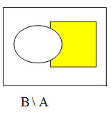

# probability theory

<details>

<summary>Table of Contents</summary>

- [probability theory](#probability-theory)
	- [Термины](#термины)
		- [`Теория вероятностей`](#теория-вероятностей)
		- [`Событие`](#событие)
		- [`Вероятность`](#вероятность)
			- [Полная группа событий](#полная-группа-событий)
			- [Классификация событий](#классификация-событий)
				- [`Совместные`](#совместные)
				- [`Несовместимые`](#несовместимые)
				- [`Достоверное`](#достоверное)
				- [`Возможное` / `Случайное`](#возможное--случайное)
				- [`Равновозможное`](#равновозможное)
				- [`Противоположное` / `Дополнительное`](#противоположное--дополнительное)
		- [Аксиоматическое определение вероятности](#аксиоматическое-определение-вероятности)
		- [Асимметрия](#асимметрия)
		- [Бесповторная выборка](#бесповторная-выборка)
		- [Вероятность](#вероятность-1)
		- [Внутрнгрупповая дисперсия](#внутрнгрупповая-дисперсия)
		- [Выборка](#выборка)
		- [Геометрическое определение вероятности](#геометрическое-определение-вероятности)
		- [Гистограмма](#гистограмма)
		- [Групповая дисперсия](#групповая-дисперсия)
		- [Групповая средняя](#групповая-средняя)
		- [Двумерная случайная величина](#двумерная-случайная-величина)
		- [Дискретная случайная величина](#дискретная-случайная-величина)
		- [Дисперсия](#дисперсия)
		- [Доверительный интервал](#доверительный-интервал)
		- [Достоверное событие](#достоверное-событие)
		- [Закон распределения случайной величины](#закон-распределения-случайной-величины)
		- [Интервальная оценка](#интервальная-оценка)
		- [Конкурирующая гипотеза](#конкурирующая-гипотеза)
		- [Корреляционная зависимость](#корреляционная-зависимость)
		- [Корреляционный момент](#корреляционный-момент)
		- [Коэффициент вариации](#коэффициент-вариации)
		- [Коэффициент корреляции](#коэффициент-корреляции)
		- [Критическая область](#критическая-область)
		- [Это требуется знать при запросе: перевод баллов ЕГЭ по математике профиль Межгрупповая дисперсия](#это-требуется-знать-при-запросе-перевод-баллов-егэ-по-математике-профиль-межгрупповая-дисперсия)
		- [Мода](#мода)
		- [Моменты случайных величин](#моменты-случайных-величин)
		- [Непрерывная случайная величина](#непрерывная-случайная-величина)
		- [Несмещенная оценка](#несмещенная-оценка)
		- [Нулевая гипотеза](#нулевая-гипотеза)
		- [Общая дисперсия](#общая-дисперсия)
		- [Плотность распределения вероятностей](#плотность-распределения-вероятностей)
		- [Повторная выборка](#повторная-выборка)
		- [Полигон частот](#полигон-частот)
		- [Производящая функция](#производящая-функция)
		- [Размах варьирования R](#размах-варьирования-r)
		- [Регрессия](#регрессия)
		- [Случайная величина](#случайная-величина)
		- [Состоятельная оценка](#состоятельная-оценка)
		- [Статистическая гипотеза](#статистическая-гипотеза)
		- [Статистический критерий](#статистический-критерий)
		- [Статистическое распределение выборки](#статистическое-распределение-выборки)
		- [Стохастическая зависимость](#стохастическая-зависимость)
		- [Теорема Лапласа](#теорема-лапласа)
		- [Теория вероятностей](#теория-вероятностей-1)
		- [Точечная оценка](#точечная-оценка)
		- [Условная вероятность](#условная-вероятность)
		- [Формула Байеса](#формула-байеса)
		- [Формула Бернулли](#формула-бернулли)
		- [Функция распределения](#функция-распределения)
		- [Характеристики положения](#характеристики-положения)
		- [Характеристики рассеивания](#характеристики-рассеивания)
		- [Центральная предельная теорема](#центральная-предельная-теорема)
		- [Эксцесс распределения](#эксцесс-распределения)
		- [Эффективная оценка](#эффективная-оценка)
	- [Операции над событиями](#операции-над-событиями)
		- [Формулы](#формулы)
		- [Формулы Де Моргана](#формулы-де-моргана)
		- [Сумма / Объединение / `∪`](#сумма--объединение--)
		- [Произведение / `∩`](#произведение--)
		- [Разность / `/`](#разность--)
		- [Отрицание / Инверсия / Противоположное / Несовместное / `Ā`](#отрицание--инверсия--противоположное--несовместное--ā)
		- [Влечение / Вхождение / `⊂`](#влечение--вхождение--)
	- [Свойства вероятности](#свойства-вероятности)
		- [1](#1)
		- [2](#2)
		- [3](#3)
		- [4](#4)
	- [Элементы комбинаторики](#элементы-комбинаторики)
		- [Размещения](#размещения)
		- [Перестановки](#перестановки)
		- [Сочетания](#сочетания)
	- [Математическое ожидание](#математическое-ожидание)
	- [Дисперсия случайной величины](#дисперсия-случайной-величины)
	- [Стандартное отклонение](#стандартное-отклонение)
	- [ССылки](#ссылки)

</details>

---

## Термины

### `Теория вероятностей`

это раздел математики, который изучает закономерности случайных явлений

Для количественного сравнения событий по степени возможности их появления вводится числовая мера, которая называется вероятностью события.

Вероятностью события называется число, являющееся выражением меры объективной возможности появления события.

Вероятность события `A` будем обозначать символом `P(A)`.

Вероятность события `A` равна отношению числа случаев `m`, благоприятствующих ему, из общего числа `n` единственно возможных, равновозможных и несовместных случаев к числу `n`, т.е.

```
P(A) = m / n
```

вероятность события является неотрицательным числом и может изменяться в пределах от `0` до `1` в зависимости от того, какую долю составляет благоприятствующее число случаев от общего числа случаев:

```
0 <= m <= n
0 <= P(A) <= 1.
```

---

---

### `Событие`

исход эксперимента

---

---

### `Вероятность`

> События обозначаются заглавными буквами латинского алфавита A,B,C и т.д.

Определение :

- отношение количества тех наблюдений, при которых рассматриваемое событие наступило, к общему количеству наблюдений
- это количественная мера осуществимости некоторого события при наличии неопределённости, то есть в ситуации, когда это событие характеризуется как возможное
- степень ( _относительная мера, количественная оценка_ ) возможности наступления некоторого события

Определения бывают:

- `Классическое`
- `геометрическое`
- `Частотное` ( статистическое )
- `Аксиоматическое`

Условия:

`n` - количество экспериментов

`n` !== ∞ ( infinity )

вероятность измеряется дробным числом от `0` до `1`

#### Полная группа событий

- система случайных событий такая, что в результате произведенного случайного эксперимента непременно произойдет одно из них.
- Группа / массив всех возможных `совместных` исходов события

Сумма полной группы событий ( сумма вероятностей всех событий ) === `1`

> Например, в урне находится десять шаров, из них шесть шаров красных, четыре белых, причем пять шаров имеют номера. A — появление красного шара при одном извлечении, B — появление белого шара, C — появление шара с номером

Группа событий называется полной, если хотя бы одно из событий происходит обязательно `A1 ∪ A2 ∪ A3 ∪ ... ∪ An = Ω`

Полная группа событий называется полной группой попарно-несовместных событий, если любые два события этой группы одновременно произойти не могут.

---

#### Классификация событий

##### `Совместные`

наступление одного из событий **не исключает** наступления другого.

> подбрасываются две игральные кости. Событие `A` — выпадание трех очков на первой игральной кости, событие `B` — выпадание трех очков на второй кости. `A` и `B` — совместные события.

---

##### `Несовместимые`

наступление одного из событий **исключает** наступления другого.

> пусть в магазин поступила партия обуви одного фасона и размера, но разного цвета. Событие `A` — наудачу взятая коробка окажется с обувью черного цвета, событие `B` — коробка окажется с обувью коричневого цвета, `A` и `B` — несовместные события.

---

##### `Достоверное`

Событие называется **достоверным**, если оно обязательно произойдет в условиях данного опыта.

---

##### `Возможное` / `Случайное`

В результате опыта оно может появиться, но может и не появиться.

> Примером случайного события может служить выявление дефектов изделия при контроле партии готовой продукции, несоответствие размера обрабатываемого изделия заданному, отказ одного из звеньев автоматизированной системы управления.

---

##### `Равновозможное`

По условиям испытания ни одно из этих событий не является объективно более возможным, чем другие.

> Например, пусть магазину поставляют электролампочки ( причем в равных количествах ) несколько заводов-изготовителей. События, состоящие в покупке лампочки любого из этих заводов.

---

##### `Противоположное` / `Дополнительное`

> Пишется как буква события с черточкой сверху. Из программирования - это отрицание `!A`

событие, которое обязательно должно произойти, если не наступило некоторое событие `A`.

Противоположные события несовместны и единственно возможны.

Они образуют полную группу событий.

> Например, если партия изготовленных изделий состоит из годных и бракованных, то при извлечении одного изделия оно может оказаться либо годным — событие `A`, либо бракованным — событие `!A`.

---

### Аксиоматическое определение вероятности

отношение подмножества, благоприятствующего событию к общему множеству

---

### Асимметрия

отношение центрального момента третьего порядка к кубу среднеквадратического отклонения

---

### Бесповторная выборка

выборка, при которой отобранный объект после проведения обследований не возвращается в генеральную совокупность

---

### Вероятность

отношение числа благоприятных исходов к общему числу исходов

---

### Внутрнгрупповая дисперсия

средняя арифметическая групповых дисперсий, взвешенная по объемам групп

---

### Выборка

совокупность случайно отобранных из изучаемой совокупности объектов

---

### Геометрическое определение вероятности

отношение длины отрезка к длине отрезка L

---

### Гистограмма

ступенчатая фигура, состоящая из прямоугольников, основаниями которых служат интервалы длиною h, а высоты n

---

### Групповая дисперсия

дисперсия значений признака, принадлежащих группе, относительно групповой средней

---

### Групповая средняя

среднее арифметическое значений признака, принадлежащих группе

---

### Двумерная случайная величина

величина, имеющая два аргумента

---

### Дискретная случайная величина

величина, принимающая отдельные значения с определенными вероятностями

---

### Дисперсия

математическое ожидание квадрата отклонения случайной величины от ее математического ожидания

---

### Доверительный интервал

интервал, который покрывает неизвестный параметр θ с заданной надежностью y

---

### Достоверное событие

событие, которое обязательно произойдет, если будет осуществлена определенная совокупность условий

---

### Закон распределения случайной величины

соответствие между возможными значениями случайной величины и их вероятностями

---

### Интервальная оценка

оценка, которая определяется концами интервала

---

### Конкурирующая гипотеза

гипотеза противоречащая основной

---

### Корреляционная зависимость

зависимость, при которой при изменении одной из величин изменяется среднее значение другой

---

### Корреляционный момент

характеристика связи между двумя случайными величинами

---

### Коэффициент вариации

выраженное в процентах отношение выборочного среднего квадратического отклонения к выборочной средней

---

### Коэффициент корреляции

отношение ковариации к произведению средних квадратических отклонений двух случайных величин

---

### Критическая область

совокупность значений критерия, при которых нулевую гипотезу отвергают

---

### Это требуется знать при запросе: перевод баллов ЕГЭ по математике профиль Межгрупповая дисперсия

дисперсия групповых средних относительно общей средней

---

### Мода

варианта ряда, которая имеет наибольшую частоту

---

### Моменты случайных величин

характеристики случайных величин, определяющие математическое ожидание k-й степени отклонения случайной величины

---

### Непрерывная случайная величина

величина, принимающая значения, сколь угодно мало отличающиеся друг от друга

---

### Несмещенная оценка

оценка θ\*, математическое ожидание которой равно оцениваемому параметру θ

---

### Нулевая гипотеза

основная выдвинутая гипотеза

---

### Общая дисперсия

дисперсия значений признака всей совокупности относительно общей средней

---

### Плотность распределения вероятностей

вероятность того, что непрерывная случайная величина примет значение на указанном интервале

---

### Повторная выборка

выборка, при которой отобранный объект возвращается после проведения обследования обратно в генеральную совокупность

---

### Полигон частот

ломаная линия, отрезки которой соединяют точки (x1, n1)

---

### Производящая функция

функция, определяющая вероятность наступления события при различных вероятностях появления в каждом испытании

---

### Размах варьирования R

разность между наибольшей и наименьшей вариантой

---

### Регрессия

представление одной случайной величины как функции другой

---

### Случайная величина

величина, которая в результате испытания примет одно и только одно значение до опыта не известно какое

---

### Состоятельная оценка

оценка, которая при n→∞ стремится по вероятности к оцениваемому параметру

---

### Статистическая гипотеза

гипотеза о виде неизвестного распределения, или параметрах неизвестного распределения

---

### Статистический критерий

случайная величина, служащая для проверки нулевой гипотезы

---

### Статистическое распределение выборки

перечень вариант и соответствующих им частот или относительных частот

---

### Стохастическая зависимость

зависимость, при которой изменение одной из величин влечет изменение другой

---

### Теорема Лапласа

определение вероятности наступления события в k измерениях из n (при больших k и n)

---

### Теория вероятностей

наука, изучающая общие закономерности случайных явлений массового характера

---

### Точечная оценка

оценка, которая определяется одним числом

---

### Условная вероятность

вероятность наступления интересующего нас события, связанная с дополнительными условиями

---

### Формула Байеса

определение апостериорной (послеопытной) вероятности на основе априорной (доопытной) на основе проведения эксперимента

---

### Формула Бернулли

определение вероятности наступления события в измерениях из n

---

### Функция распределения

функция, определяющая вероятность того, что X примет значение меньше x

---

### Характеристики положения

характеристики, определяющие наиболее возможные значения случайной величины

---

### Характеристики рассеивания

характеристики, определяющие разброс возможных значений случайной величины

---

### Центральная предельная теорема

теорема, доказывающая, что суммирование большого числа случайных величин с различными законами распределения приводит в итоге к нормальному распределению

---

### Эксцесс распределения

величина, определяемая отношением центрального момента четвертого порядка к четвертой степени среднего квадратического отклонения за вычетом тройки

---

### Эффективная оценка

такая оценка, которая при заданном объеме выборки n имеет наименьшую возможную дисперсию.

---

---

## Операции над событиями

### Формулы

- `A ∩ A === A`
- `A ∩ !A === ∅`
- `A ∩ Ω === A`
- `A ∩ ∅ === ∅`
- `A ∩ B === B ∩ A`
- `A∩ ( B∩ C ) === ( A∩ B ) ∩ C`
- `A ∪ A === A`
- `A ∪ !A === Ω`
- `A ∪ Ω === Ω`
- `A ∪ ∅ === A`
- `A ∪ B === B ∪ A`
- `A ∪ ( B ∪ C ) === ( A ∪ B ) ∪ C`
- `A ∩ ( B ∪ C ) === ( A ∩ B ) ∪ ( A ∩ C )`
- `A ∪ ( B ∩ C ) === ( A ∪ B ) ∩ ( A ∪ C )`

---

### Формулы Де Моргана

- `!( A ∪ B ) === !A ∩ !B`
- `A ∩ B === !A ∪ B`

### Сумма / Объединение / `∪`

Суммой событий `A` и `B` называется третье событие С которое происходит при наступлении хотя бы одного из событий `A` или `B`, обозначается `C = A ∪ B`.

Суммой группы событий `A1 ... An` называется событие `C = A1 ∪ A2 ∪ … ∪ An`.

> В программировании `||` или `or`


---

### Произведение / `∩`

Произведением событий `A` и `B` называется событие С которое происходит тогда когда происходит и `A` и `B`, обозначается: `C = A ∩ B`.

Произведением группы из `n` - событий - `A1, A2 ... An` есть событие `A`, обозначается `A = A1 ∩ A2 ∩ A3 … An`.

> В программировании `&&` или `and`


События `A` и `B` называются несовместными, если они одновременно происходить не могут `A ∩ B = ∅`.


---

### Разность / `/`

Разностью событий `A` и `B` называется третье событие С которое происходит тогда когда `A` происходит, а `B` не происходит: `C = A / B`.

> В программировании `A && !B`




---

### Отрицание / Инверсия / Противоположное / Несовместное / `Ā`

Событие `Ā` называется противоположным событию `A`, если оно происходит тогда, когда `A` не происходит.

> В программировании `!A`


---

### Влечение / Вхождение / `⊂`

Говорят, что событие `A` влечет событие `B`, если при наступлении события `A` обязательно происходит событие `B`, обозначается: `A ⊂ B`.

События `A` и `B` называются равносильными или тождественными, если `A ⊂ B` и `B ⊂ A` т.е. при наступлении одного, второе обязательно происходит.


---

---

## Свойства вероятности

### 1

Если все случаи являются благоприятствующими данному событию `A`, то это событие обязательно произойдет. Следовательно, рассматриваемое событие является достоверным, а вероятность его появления `P(A) = 1`, так как в этом случае `m = n`:

`P(A) = m / n => 1`

---

### 2

Если нет ни одного случая, благоприятствующего данному событию `A`, то это событие в результате опыта произойти не может. Следовательно, рассматриваемое событие является невозможным, а вероятность его появления `P(A) = 0`, так как в этом случае `m = 0`:

`P(A) = m / n => 0`

---

### 3

Вероятность наступления событий, образующих полную группу, равна единице.

---

### 4

Вероятность наступления противоположного события `!A` определяется так же, как и вероятность наступления, события `A`:

`P(A) = ( n - m ) / ( n ) = 1 - ( m / n )`

где `( n - m )`
— число случаев, благоприятствующих появлению противоположного события `!A`. Отсюда вероятность наступления противоположного события `!A` равна разнице между единицей и вероятностью наступления события `A`:

`P(!A) = 1 - P(A)`

> Важное достоинство классического определения вероятности события состоит в том, что с его помощью вероятность события можно определить, не прибегая к опыту, а исходя из логических рассуждений.

---

---

## Элементы комбинаторики

### Размещения

Рассмотрим некоторое множество `Х`, состоящее из `n` элементов `X={x1,x2,...,xn}`. Будем выбирать из этого множества различные упорядоченные подмножества `Y` из `k` элементов.

Размещением из n элементов множества Х по k элементам назовем любой упорядоченный набор `(xi1,xi2,...,xik)` элементов множества `Х`.

Если выбор элементов множества Y из Х происходит с возвращением, т.е. каждый элемент множества Х может быть выбран несколько раз, то число размещений из n по k находится по формуле nk (размещения с повторениями).

Если же выбор делается без возвращения, т.е. каждый элемент множества Х можно выбирать только один раз, то количество размещений из n по k обозначается Akn и определяется равенством


> размещения без повторений.

---

### Перестановки

Частный случай размещения при n=k называется перестановкой из n элементов. Число всех перестановок из n элементов равно .


---

### Сочетания

Пусть теперь из множества Х выбирается неупорядоченное подмножество Y (порядок элементов в подмножестве не имеет значения). Сочетаниями из n элементов по k называются подмножества из k элементов, отличающиеся друг от друга хотя бы одним элементом. Общее число всех сочетаний из n по k обозначается Ckn и равно


Справедливы равенства:


---

---

## Математическое ожидание

это ожидаемый результат от какого-то действия.

число, относительно которого стабилизируется среднее арифметическое возможных значений случайной величины при достаточно большом количестве испытаний

> Например, можно рассчитать ожидаемую стоимость инвестиции в определённый момент в будущем. Рассчитывая математическое ожидание перед тем, как инвестировать, можно выбрать наилучший сценарий который, по мнению инвестора, даст наилучший результат.

Случайная величина может быть двух типов:

Дискретной: число возможных значений X — это числимое конечное или бесконечное множество точек; пример: количество дефектных устройств в производстве фабрики.

Непрерывной: X может принимать любое значение в заданном диапазоне; пример: концентрация углекислого газа в воде.
Математическое ожидание дискретной случайной величины рассчитывается этой формулой:

Математическое ожидание дискретной случайной величины рассчитать формула:

```
M(X) = ∑ xi × pi
```

М — математическое ожидание,
X — случайная величина,
p — вероятность появления случайной величины.

```cpp
double expectation(double* var, size_t size) {
  double sum = 0;
  size_t i;

  for(i = 0; i < size; ++i)
  sum += var[i];

  return sum / size;
}
```

---

---

## Дисперсия случайной величины

вычисляется по следующей формуле:

```
D(X) = ( M( X − M(X)) )^2
```

которую также часто записывают в более удобном для расчетов виде:

```
D(X) = M(X2) − ( M(X) )^2.
```

```cpp
double variance(double* var, size_t size) {
  double sum = 0;
  double mean = expectation(var, size);

  size_t i;

  for(i = 0; i < size; ++i)
  sum += (var[i] - mean) * (var[i] - mean);

  return sum / size;
}
```

---

---

## Стандартное отклонение

простыми словами это мера того, насколько разбросан набор данных.

Вычисляя его, можно узнать, являются ли числа близкими к среднему значению или далеки от него. Если точки данных находятся далеко от среднего значения, то в наборе данных имеется большое отклонение; таким образом, чем больше разброс данных, тем выше стандартное отклонение.

Стандартное отклонение обозначается буквой σ (греческая буква сигма).

Стандартное отклонение также называется:

- среднеквадратическое отклонение,
- среднее квадратическое отклонение,
- среднеквадратичное отклонение,
- квадратичное отклонение,
- стандартный разброс.

```
D(X) = σ^2
```

```cpp
double std_deviation(double* var, size_t size) {
  return sqrt(variance(var, size));
}
```

---

---

## ССылки

- [Основные понятия](http://mathhelpplanet.com/static.php?p=osnovnye-ponyatiya-tyeorii-veroyatnostyei)
- [Словарь терминов](https://referati-besplatno.ru/slovar-terminov-po-teorii-veroyatnostej-i-matematicheskoj-statistike/)
- [События, операции](https://3dstroyproekt.ru/teorija-verojatnosti/ponjatie-sobytija-operacii-nad-sobytijami)
- [Элементы комбинаторики](https://www.matburo.ru/tvbook_sub.php?p=par11)
- Математическое ожидание
  - [1](https://www.uznaychtotakoe.ru/matematicheskoe-ozhidanie/)
  - [2](https://100task.ru/sample/111.aspx)
- Дисперсия
  - [1](https://www.matburo.ru/tvart_sub.php?p=art_disp)
  - [2](https://www.matematicus.ru/teoriya-veroyatnosti/dispersiya-sluchajnoj-velichiny)
